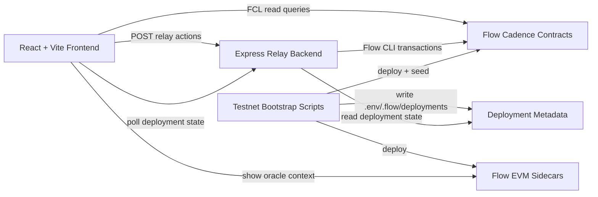

# FlowPilot

FlowPilot is a production-style autonomous finance operating console built on Flow. It combines Flow Cadence contracts, a relay-backed backend, a React dashboard, and Flow EVM sidecars to deliver a walletless managed-account experience for payroll streaming, natural-language automation, lottery participation, subscriptions, gift cards, portfolio controls, and work credentials.

This repository is no longer a mock UI shell. The current app is wired to real testnet contracts, real seeded state, and real relay-triggered transactions.

## Table of Contents

- [What It Does](#what-it-does)
- [Current State](#current-state)
- [Architecture](#architecture)
- [Repository Layout](#repository-layout)
- [Feature Walkthrough](#feature-walkthrough)
- [Tech Stack](#tech-stack)
- [Getting Started](#getting-started)
- [Environment and Secrets](#environment-and-secrets)
- [Local Development](#local-development)
- [Flow Testnet Bootstrap](#flow-testnet-bootstrap)
- [Runtime Artifacts](#runtime-artifacts)
- [Frontend Views](#frontend-views)
- [Backend API](#backend-api)
- [Cadence Contracts, Scripts, and Transactions](#cadence-contracts-scripts-and-transactions)
- [Natural-Language Rule Engine](#natural-language-rule-engine)
- [Testing](#testing)
- [Operational Notes](#operational-notes)
- [Troubleshooting](#troubleshooting)
- [Known Limitations](#known-limitations)
- [Security Notes](#security-notes)

## What It Does

FlowPilot models a single managed treasury operator on Flow testnet.

Core capabilities:

- stream salary-like balances into a managed vault,
- accrue and claim yield-backed earnings,
- compile natural-language rules into serialized RuleGraph automations,
- route treasury capital through savings, DCA, subscriptions, and portfolio rules,
- run a lossless lottery pool where principal stays intact and only yield is awarded,
- mint and redeem yield-bearing gift cards,
- publish on-chain subscription and portfolio resources through public capabilities,
- expose a non-transferable work credential that captures income and history,
- bridge Flow-native flows with Flow EVM oracle and verification sidecars.

## Current State

As of April 1, 2026, the repository has been verified locally against Flow testnet with a live seeded account.

Verified end-to-end from the UI:

- claim streamed earnings,
- parse and deploy a natural-language DCA rule,
- deposit into the lottery pool,
- trigger a lottery draw,
- create a recurring subscription,
- mint a gift card,
- redeem a gift card,
- refresh dashboard activity from live on-chain results.

Important context:

- the frontend reads live state through FCL queries,
- the backend relays writes through Flow CLI using a managed signer,
- the root `.env` is the shared runtime source of truth,
- the backend now loads the root `.env` before initializing relay helpers,
- signer resolution falls back to `.flow/testnet.flow.json` so generated aliases like `flow-tester` work correctly.

## Architecture



High-level flow:

1. `scripts/testnet/bootstrapTestnet.mjs` creates or reuses a Flow testnet account, deploys Cadence contracts, seeds dashboard state, deploys Flow EVM contracts, and writes local metadata.
2. The frontend reads public Cadence state directly with FCL.
3. The backend exposes relay endpoints for writes and deployment metadata.
4. Transaction files and inline Cadence are rewritten at runtime so placeholder imports targeting `0x0000000000000000` are replaced with the active deployed contract address.
5. The dashboard merges persisted seeded activity with fresh locally triggered relay actions.

## Repository Layout

```text
frontend/                     React + Vite app shell and live hooks
backend/                      Express relay, rule compiler, Flow CLI wrapper
cadence/contracts/            Core Flow Cadence contracts
cadence/contracts/handlers/   Scheduler/rebalance handler contracts
cadence/scripts/              Public read scripts used by frontend and verification
cadence/transactions/         Managed write transactions used by relay and seeding
evm/contracts/                Flow EVM contracts for oracle + work proof validation
evm/scripts/                  Hardhat deployment scripts for Flow EVM
scripts/testnet/              Testnet config generation, deploy, and seed helpers
tests/                        Cadence, EVM, and end-to-end tests
flowpilot.html                Original design reference that informed the new UI
flow.json                     Safe base Flow project config without committed secrets
flow-tester.private.json      Ignored local-only testnet credential file
```

## Feature Walkthrough

### 1. Managed payroll stream

`FlowPilotVault`, `VaultStateRegister`, and `WorkCredential` work together to model a worker vault, its claimable earnings, principal routed into yield, and an audit trail of work and income.

### 2. Natural-language automations

The frontend previews a plain-English rule. The backend parses it with regex-first logic and optional LLM fallback, serializes the result, and deploys it to `RuleGraph`.

### 3. Yield-backed treasury actions

Rules can express savings splits, DCA, subscription payments, roundups, portfolio rebalancing, gift-card minting, and lottery entry actions.

### 4. Lossless lottery

`LotteryPool` separates principal from yield. Depositors keep principal exposure while the yield vault funds draws.

### 5. Yield-bearing gift cards

`GiftCardNFT` mints cards that can accumulate value before redemption.

### 6. On-chain subscriptions

`SubscriptionStream` publishes recurring payment resources through public capabilities that the UI can query directly.

### 7. AI-managed portfolio context

`PortfolioVault` exposes target allocations, holdings, rebalance metadata, and risk profile. Flow EVM sidecars provide adjacent oracle and proof-verification context.

### 8. Work credential

`WorkCredential` acts as a non-transferable record of stream history, total earned, total yield earned, milestones completed, disputes, and derived credit score.

## Tech Stack

### Frontend

- React 18
- TypeScript
- Vite 5
- Flow FCL

### Backend

- Express
- TypeScript
- Flow CLI relay wrapper
- OpenAI-compatible LLM integration for fallback rule parsing

### On-chain

- Cadence 1.0-style Flow contracts
- Flow testnet deployment via generated `.flow/testnet.flow.json`
- Flow EVM Solidity contracts deployed with Hardhat

### Tooling

- npm workspaces
- Jest + ts-jest
- Hardhat
- Flow JS Testing

## Getting Started

### Prerequisites

- Node.js 20+
- npm 10+
- Flow CLI installed at `/opt/homebrew/bin/flow` on macOS
- a reusable Flow testnet account stored locally in `flow-tester.private.json`
- optional OpenAI or OpenRouter credentials if you want LLM parsing fallback

### Install dependencies

```bash
npm install
```

That installs the root workspace plus `frontend` and `backend` packages.

### Minimum local boot sequence

```bash
npm run deploy:testnet:all
npm run dev
```

If the account is already deployed and you only want to refresh seeded state, prefer:

```bash
npm run seed:testnet
npm run dev
```

## Environment and Secrets

Copy `.env.example` to `.env` if you want to manage values manually.

```bash
cp .env.example .env
```

### Secret handling model

- `.env` is ignored.
- `.flow/` is ignored.
- `flow-tester.private.json` is ignored.
- `flow.json` is intentionally safe to commit and must not contain private keys.

### Local credential file

Create an ignored file at the repository root:

```json
{
	"accounts": {
		"flow-tester": {
			"address": "YOUR_16_HEX_ADDRESS",
			"key": "YOUR_64_HEX_PRIVATE_KEY"
		}
	}
}
```

The bootstrap helpers prefer credentials in this order:

1. `FLOW_TESTNET_ADDRESS` and `FLOW_TESTNET_KEY` from `.env`
2. `flow-tester.private.json`
3. generated `.flow/testnet.flow.json`
4. `~/flow.json`

They no longer use the tracked root `flow.json` as a private-key source.

### Environment variables

#### Flow account and deployment

| Variable | Purpose |
| --- | --- |
| `FLOW_TESTNET_ACCOUNT_NAME` | Managed signer alias used by bootstrap and backend relay |
| `FLOW_TESTNET_ADDRESS` | Optional Flow testnet address override |
| `FLOW_TESTNET_KEY` | Optional Flow testnet private key override |
| `FLOW_CONTRACT_ADDRESS` | Active deployed Cadence address for runtime import rewriting |

#### Dashboard seed controls

| Variable | Purpose |
| --- | --- |
| `FLOW_DASHBOARD_STREAM_ID` | Primary seeded stream id |
| `FLOW_DASHBOARD_INITIAL_DEPOSIT` | Initial stream funding amount |
| `FLOW_DASHBOARD_ADDITIONAL_PRINCIPAL` | Additional principal routed into treasury reserve |
| `FLOW_DASHBOARD_SALARY_RATE` | Seeded salary rate per second |
| `FLOW_DASHBOARD_ELAPSED_SECONDS` | Synthetic elapsed time used to accrue stream value |
| `FLOW_DASHBOARD_HARVESTED_YIELD` | Yield injected during dashboard seeding |
| `FLOW_DASHBOARD_LOTTERY_ID` | Seeded lottery pool id |
| `FLOW_DASHBOARD_PORTFOLIO_ID` | Seeded portfolio id |

#### Backend

| Variable | Purpose |
| --- | --- |
| `BACKEND_PORT` | Express server port |
| `VITE_BACKEND_URL` | Frontend target URL for backend relay |

#### Frontend

| Variable | Purpose |
| --- | --- |
| `VITE_FLOW_NETWORK` | Flow network name for the UI |
| `VITE_FLOW_CONTRACT_ADDRESS` | Runtime Cadence contract address |
| `VITE_FLOW_DASHBOARD_ACCOUNT_ADDRESS` | Seeded account shown by the dashboard |
| `VITE_FLOW_DASHBOARD_STREAM_ID` | Primary stream id displayed by the app |
| `VITE_FLOW_DASHBOARD_LOTTERY_ID` | Primary lottery pool id |
| `VITE_FLOW_DASHBOARD_PORTFOLIO_ID` | Primary portfolio id |
| `VITE_FLOW_DASHBOARD_SALARY_RATE` | Dashboard salary ticker rate |

#### Flow EVM

| Variable | Purpose |
| --- | --- |
| `EVM_RPC_URL` | Flow EVM RPC endpoint |
| `EVM_DEPLOYER_PRIVATE_KEY` | Private key for Hardhat EVM deployments |
| `AI_ORACLE_PUBLIC_KEY` | Optional oracle-related public key |
| `EVM_ORACLE_AGGREGATOR_ADDRESS` | Deployed `OracleAggregator` address |
| `EVM_WORK_PROOF_VERIFIER_ADDRESS` | Deployed `WorkProofVerifier` address |

#### LLM fallback parsing

| Variable | Purpose |
| --- | --- |
| `OPENAI_API_KEY` | Enables OpenAI fallback parser |
| `OPENAI_MODEL` | OpenAI model name |
| `OPENROUTER_API_KEY` | Enables OpenRouter fallback parser |
| `OPENROUTER_BASE_URL` | OpenRouter base URL |
| `OPENROUTER_FALLBACK_MODEL` | OpenRouter model name |
| `OPENROUTER_SITE_URL` | Header value for OpenRouter |
| `OPENROUTER_APP_NAME` | Title header for OpenRouter |

## Local Development

### Start both apps

```bash
npm run dev
```

This runs:

- backend on `http://localhost:3001`
- frontend on `http://localhost:5173`

### Start each app separately

```bash
npm run dev --workspace=backend
npm run dev --workspace=frontend
```

### Build

```bash
npm run build --workspace=backend
npm run build --workspace=frontend
```

### Tests

```bash
npm test
```

## Flow Testnet Bootstrap

### Available commands

```bash
npm run flow:config:testnet   # Generate .flow/testnet.flow.json from local credentials
npm run deploy:testnet        # Deploy Cadence contracts only
npm run seed:testnet          # Seed dashboard state only
npm run deploy:testnet:all    # Deploy Cadence, seed dashboard state, deploy Flow EVM sidecars
npm run deploy:evm            # Deploy Flow EVM contracts only
```

### What the bootstrap does

`scripts/testnet/bootstrapTestnet.mjs` performs the following:

1. resolves a reusable Flow testnet account,
2. generates `.flow/testnet.flow.json`,
3. prepares Cadence source files with the active deployed contract address,
4. deploys the Cadence contracts,
5. seeds the stream, rules, lottery, portfolio, subscription, and gift-card data,
6. deploys Flow EVM oracle contracts,
7. writes metadata into ignored local artifacts.

### Reseeding vs redeploying

Use `npm run seed:testnet` when the account already stores the seeded objects. That path is intended for refreshing dashboard data without trying to recreate everything from scratch.

## Runtime Artifacts

Bootstrap and relay flows generate several local artifacts:

| File | Description |
| --- | --- |
| `.flow/testnet.flow.json` | Generated Flow CLI config with the resolved signer alias |
| `.env` | Shared runtime env used by frontend, backend, and scripts |
| `deployments/cadence-testnet.json` | Seed metadata, surfaced features, tx ids, and verification state |
| `deployments/evm-deployments.json` | Flow EVM deployment outputs |

These files are intentionally ignored and should be treated as local runtime state, not committed sources.

## Frontend Views

The React app exposes these primary views:

| View | Purpose |
| --- | --- |
| `Dashboard` | Global balance, yield, rules, stream status, lottery teaser, and merged activity feed |
| `Stream` | Payroll, claimable earnings, treasury ledger breakdown, and oracle context |
| `Rules` | RuleGraph contents, NL compiler preview, and deployment actions |
| `Yield` | Yield principal, earned yield, and autopilot routing context |
| `DCA` | DCA-focused rules and recurring savings concepts |
| `Portfolio` | Allocation targets, risk profile, oracle context, and rebalance metadata |
| `Subscriptions` | Published subscription resources and creation flow |
| `Lottery` | Prize pool state, deposit action, and draw control |
| `Gift Cards` | Minting and redemption of yield-backed cards |
| `Credential` | WorkCredential metrics and employment-style history |

The new shell intentionally mirrors the design system captured in `flowpilot.html`: fixed sidebar, sticky topbar, view-based navigation, bold typography, and a high-contrast treasury-console aesthetic.

## Backend API

The backend lives in `backend/src/index.ts` and currently exposes:

| Method | Route | Purpose |
| --- | --- | --- |
| `GET` | `/health` | Simple health probe |
| `GET` | `/api/deployment-state` | Returns generated deployment metadata and active signer alias |
| `POST` | `/api/parse-rule` | Parse a rule for live preview |
| `POST` | `/api/create-rule` | Compile and deploy a rule to `RuleGraph` |
| `POST` | `/api/create-stream` | Returns a stream-creation transaction payload |
| `POST` | `/api/claim-balance` | Relay a `ClaimBalance.cdc` transaction |
| `POST` | `/api/lottery/deposit` | Relay a `DepositLottery.cdc` transaction |
| `POST` | `/api/lottery/draw` | Relay a `DrawLottery.cdc` transaction |
| `POST` | `/api/giftcards/mint` | Relay a `MintGiftCard.cdc` transaction |
| `POST` | `/api/giftcards/redeem` | Relay a `RedeemGiftCard.cdc` transaction |
| `POST` | `/api/subscriptions/create` | Relay a `CreateSubscription.cdc` transaction |

Notable backend behavior:

- CORS is restricted to local frontend origins.
- Relay execution uses Flow CLI JSON output and treats JSON `error` payloads as hard failures.
- Signer resolution prefers `FLOW_TESTNET_ACCOUNT_NAME` and otherwise reads `.flow/testnet.flow.json`.
- The backend imports `./env` before relay utilities so `.env` is loaded early enough for module initialization.

## Cadence Contracts, Scripts, and Transactions

### Core contracts

| Contract | Role |
| --- | --- |
| `FlowDeFiMathUtils` | Shared math helpers |
| `VaultStateRegister` | Vault state and timestamp register |
| `FlowPilotVault` | Managed salary and reserve vault |
| `RuleGraph` | Stores and mutates serialized automation rules |
| `GiftCardNFT` | Yield-bearing gift card NFT collection |
| `LotteryPool` | Principal + yield separation for lossless lottery logic |
| `PortfolioVault` | Managed portfolio allocations and rebalance state |
| `SubscriptionStream` | Recurring payment resources |
| `WorkCredential` | Non-transferable work and income identity |

### Handler contracts

These represent scheduler-related strategy hooks under `cadence/contracts/handlers/`:

- `AIRebalanceHandler.cdc`
- `DCAHandler.cdc`
- `LotteryDrawHandler.cdc`
- `MilestoneHandler.cdc`
- `SubscriptionHandler.cdc`
- `YieldRebalanceHandler.cdc`

### Read scripts used by the app

- `GetActiveRules.cdc`
- `GetClaimableBalance.cdc`
- `GetGiftCards.cdc`
- `GetLotteryPool.cdc`
- `GetPortfolio.cdc`
- `GetSubscription.cdc`
- `GetVaultState.cdc`
- `GetWorkCredential.cdc`

### Write transactions used by seeding and relay flows

- `AddRule.cdc`
- `ClaimBalance.cdc`
- `CreateStream.cdc`
- `CreateSubscription.cdc`
- `InitPortfolio.cdc`
- `InitVault.cdc`
- `InitLotteryPool.cdc`
- `DepositLottery.cdc`
- `AccumulateLotteryYield.cdc`
- `DrawLottery.cdc`
- `MintGiftCard.cdc`
- `RedeemGiftCard.cdc`
- `SeedDashboardState.cdc`

## Natural-Language Rule Engine

FlowPilot supports the following normalized rule families:

- `savings_split`
- `dca`
- `subscription`
- `roundup`
- `portfolio`
- `giftcard`
- `lottery_entry`

Parsing strategy:

1. `backend/src/nlCompiler.ts` handles deterministic regex-first parsing.
2. `backend/src/ruleParser.ts` falls back to `backend/src/llmRuleParser.ts` if regex parsing cannot produce a valid rule.
3. `backend/src/flowActionsBuilder.ts` serializes the parsed rule and builds the Cadence transaction payload.
4. The backend deploys the serialized rule to `RuleGraph` through relay mode.

Example input:

```text
Buy $50 of FLOW every week from stablecoin reserves.
```

Example normalized outcome:

- rule type: `dca`
- amount: `50`
- asset: `FLOW`
- interval: weekly
- scheduler interval: `604800` seconds

## Testing

Current test coverage includes:

- Cadence tests under `tests/cadence/`
- Flow EVM tests under `tests/evm/`
- End-to-end flow coverage under `tests/e2e/`

Useful commands:

```bash
npm test
npm run build --workspace=backend
npm run build --workspace=frontend
```

## Operational Notes

### Verified managed account snapshot

The local testnet snapshot used during verification included:

- a deployed Flow account and contract address,
- seeded stream id `default`,
- seeded lottery pool `primary-pool`,
- seeded portfolio `core-portfolio`,
- generated deployment activity with Flowscan transaction links,
- relay-backed UI actions successfully reflected back into the dashboard.

### Runtime model

This application is currently designed as a single-operator managed testnet product, not a general multi-wallet consumer app.

Reads:

- happen directly from Flow using FCL public queries.

Writes:

- are executed by the backend relay using a managed signer.

That makes the current UX ideal for a seeded product demo and relay verification environment.

## Troubleshooting

### Frontend shows the bootstrap-required screen

Cause:

- the dashboard account address or deployment metadata has not been generated locally.

Fix:

```bash
npm run deploy:testnet:all
```

or, if the contracts are already deployed:

```bash
npm run seed:testnet
```

### Backend cannot find the signer account

Cause:

- `.env` was missing or stale,
- `.flow/testnet.flow.json` was not generated,
- the configured alias did not match the generated Flow config.

Fix:

```bash
npm run flow:config:testnet
```

Then verify:

- `FLOW_TESTNET_ACCOUNT_NAME` in `.env`
- `.flow/testnet.flow.json` contains the same alias

### Cadence imports still point at `0x0000000000000000`

Cause:

- the app has not been given a deployed contract address.

Fix:

- run bootstrap or set `FLOW_CONTRACT_ADDRESS` and `VITE_FLOW_CONTRACT_ADDRESS`.

### `deploy:testnet:all` is noisy on an already-seeded account

Use `npm run seed:testnet` when you are reseeding an existing account instead of replaying the full bootstrap from scratch.

## Known Limitations

- The app targets one managed operator account, not a multi-user custody architecture.
- Relay execution depends on a local Flow CLI installation.
- Some NL phrases still normalize awkwardly even when the resulting rule is valid.
- The UI assumes locally generated deployment metadata is present.
- The Flow EVM sidecars provide adjacent context but are not yet driving every treasury action path.

## Security Notes

- Do not commit `.env`.
- Do not commit `.flow/`.
- Do not commit `flow-tester.private.json`.
- Do not put private keys in `flow.json`.
- If you plan to publish the repository, rotate any key that was ever committed to history before the cleanup in this branch.

## Summary

FlowPilot is now a full-stack Flow testnet operator console with:

- live on-chain reads,
- backend-relayed managed writes,
- a seeded treasury workflow,
- Cadence 1.0-era contract updates,
- Flow EVM oracle support,
- and a UI rebuilt around the `flowpilot.html` visual system.

The repository is set up for local deployment, seeding, verification, and further product iteration rather than static demo-only presentation.
